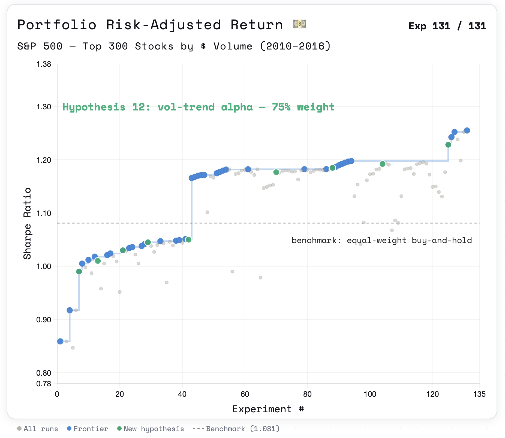

<div align="center">
  

# AutoHypothesis 
 an open-source agentic framework for quantitative finance research

</div>

<p align="center">
  <a href="LICENSE-APACHE">
    
  </a>
</p>

<div align="center">
  
</div>

## structure
```
agent.py
  ┌─────────────────────────────────────┐
  │ EDITABLE SECTION                    │  ← agent rewrites this
  │   get_signals(data)                 │
  │   get_position_sizes(signals, data) │
  │   get_regime(data)                  │
  └─────────────────────────────────────┘
  ══ FIXED ADAPTER BOUNDARY ════════════════
  ┌─────────────────────────────────────┐
  │ FIXED SECTION                       │  ← never touched
  │   UNIVERSE_SIZE = 300               │
  │   DEV_END = "2016-12-31"            │
  │   HOLDBACK_START = "2017-01-01"     │
  │   HOLDBACK_END = "2018-12-31"       │
  │   WF_START = "2019-01-01"           │
  │   WF_END = "2021-12-31"             │
  │   HOLDOUT_START = "2022-01-01"      │
  │   load_data()                       │
  │   simulate()                        │
  │   compute_metrics()                 │
  │   walk_forward()                    │
  │   CLI entry point                   │
  └─────────────────────────────────────┘

program.md          ← YOU edit this
results.csv         ← auto-generated experiment log
last_result.json    ← auto-generated, last backtest output
.agent/best_dev_agent.py      ← best DEV score snapshot
.agent/best_holdback_agent.py ← best holdback-validated snapshot
```

## quick start

Point your agent at the repo and prompt:

```
Read program.md and let's start a new experiment.
```


## the only file you edit
`program.md` — change the research directive, the hypothesis space, or the
target metrics. The agent reads this to decide what to try.

## score formula
```
score = sharpe
      - max(0, (turnover - 0.3) * 0.5)
      - max(0, (|max_drawdown| - 0.20) * 2)
```

## data split
| Period | Dates | Purpose |
|---|---|---|
| Development | 2010–2016 | Iterate freely |
| IS Holdback | 2017–2018 | One-shot gate per hypothesis |
| Walk-forward | 2019–2021 | One-shot validation per hypothesis |
| Holdout | 2022–present | Locked until final run |

## stopping criteria
| Condition | Meaning |
|---|---|
| Walk-forward passes | Target achieved |
| 200 iterations | Time limit |

## assumptions
- Transaction cost: 10bps per rebalance
- Universe: top 300 stocks by 30-day average dollar volume (selected on IS data only)
- Execution: 1-day lag on all signals

## customizing
- **Different asset class**: swap the tickers in `SP500_TICKERS` for ETFs, futures, crypto
- **Different score formula**: edit `compute_metrics()` in the fixed section AND update `program.md`
- **Different split**: change the date constants in the fixed section — this invalidates cross-experiment comparisons
- **Larger universe**: change `UNIVERSE_SIZE` in the fixed section — this invalidates cross-experiment comparisons

## limitations/what's next
1. **Survivorship bias**: delisted stocks weren't included in the MVP
2. **More realistic costs**: 10bps/trade may be optimistic for this universe
3. **Sharpe discounting for iteration**: The score formula does not penalize for the number of iterations run.
4. **Walk-forward leakage**: Since the agent can see walk-forward results, some overfitting may occur despite being prompted to generate novel hypotheses. I plan to address this with a dedicated check agent to verify hypothesis novelty.

> **Note:** The expanding window is only structurally meaningful if `get_signals()` 
> estimates parameters from data. With hardcoded parameters, the three folds reduce 
> to a single OOS backtest split into thirds.
